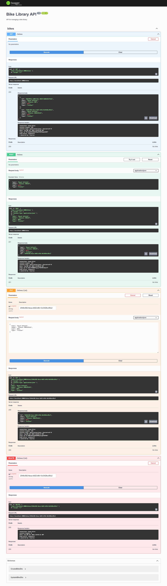

###Bike Library API

##Description
A simple REST API for managing a bike library built with Nest.js, SQLite, and Swagger documentation.

##Installation Prerequisites
- Node.js (version 14 or higher)
- npm (Node package manager)
- SQLite

##Steps to Set Up
     #1. Clone the repository:
          git clone https://github.com/nasirnaqash/nest-js-bike-api
     #2.Navigate into the project directory:
          cd bike-library-api
     #3.Install the dependencies:
          npm install
     #4.Run the application:
          npm run start
     #5.Access the API documentation at:
          http://localhost:3000/api
     #6.Endpoints
          GET /bikes: Fetch a list of all bikes
          POST /bikes: Add a new bike
          PUT /bikes/:id: Update an existing bike
          DELETE /bikes/:id: Delete a bike
     

          
